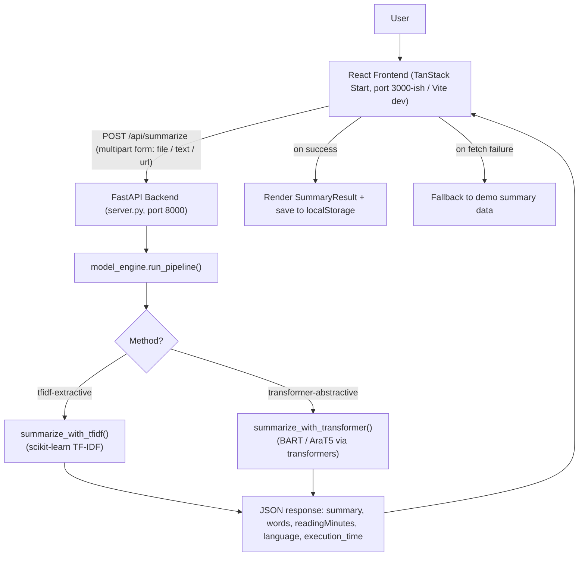
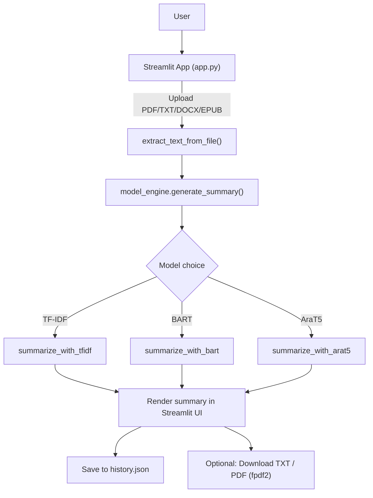

# ✨ Summarization Story AI

**Summarize any long story — PDF, TXT, or DOCX — into a concise AI-generated summary in seconds.**

Summarization Story AI pairs a Python NLP engine (TF‑IDF extractive + BART/AraT5 abstractive summarization) with a modern React web app and a bundled Streamlit alternative UI, so you can turn a full manuscript into a readable, shareable summary in one click.

---

## 📑 Table of Contents

- [Overview](#-overview)
- [Features](#-features)
- [Repository Structure](#️-repository-structure)
- [Tech Stack](#-tech-stack)
- [Architecture](#️-architecture)
- [Installation](#-installation)
- [Requirements](#-requirements)
- [Usage](#-usage)
- [API Documentation](#-api-documentation)
- [Machine Learning](#-machine-learning)
- [NLP Pipeline](#-nlp-pipeline)
- [Frontend](#️-frontend)
- [Backend](#️-backend)
- [Database](#️-database)
- [Configuration](#-configuration)
- [Environment Variables](#-environment-variables)
- [Screenshots](#️-screenshots)
- [Workflow](#-workflow)
- [Dependencies](#-dependencies)
- [Performance](#-performance)
- [Future Improvements](#-future-improvements)
- [Troubleshooting](#️-troubleshooting)
- [Contributing](#-contributing)
- [License](#-license)
- [Authors](#-authors)
- [Acknowledgments](#-acknowledgments)

---

## 📖 Overview

**What it does**

Summarization Story AI takes a long-form manuscript — a novel, script, or story — and produces a shorter, coherent summary. It supports two summarization strategies:

- **Extractive (TF‑IDF)** — selects and stitches together the most information-dense sentences directly from the original text.
- **Abstractive (Transformer)** — rewrites the story in fluent, original language using `facebook/bart-large-cnn` for English or `fatmaserry/AraT5v2-arabic-summarization` for Arabic, with automatic language detection.

**Why it exists**

Reading a full manuscript to gauge its plot, tone, or scope is slow. This project automates that first pass — giving readers, writers, editors, or researchers a fast, private way to preview a story's content, word count, and estimated reading time before committing to the full text.

**Target users**

Anyone working with long-form narrative text: readers triaging a to-read pile, writers/editors reviewing drafts, students, or developers experimenting with extractive vs. abstractive summarization on real manuscripts.

> **Note found in the repository:** The codebase ships in two parallel forms — a **FastAPI + React** web app (the primary, actively wired-up path) and a **standalone Streamlit app** (`app.py`) that reimplements the same upload → summarize → history flow independently, with its own PDF/TXT export. Both share `model_engine.py` as the summarization core. This README documents both.

---

## 🚀 Features

**Summarization**
- Extractive summarization via TF‑IDF sentence scoring (`scikit-learn`), with dynamic sentence-count scaling based on manuscript length
- Abstractive summarization via Hugging Face `transformers` pipelines (BART for English, AraT5 for Arabic)
- Automatic language detection (Arabic vs. English via Unicode range matching) that auto-switches the abstractive model
- Chunked processing (~250-word chunks) so abstractive summarization scales to full-length manuscripts rather than truncating them
- Adjustable summary length: `short`, `balanced`, `long`
- Graceful fallback to a lightweight local heuristic summarizer if `transformers`/`torch` aren't available or the model call fails

**File Handling**
- Upload support for **PDF** (`pypdf`), **DOCX** (`python-docx`), and **TXT**
- URL/web-article ingestion in the FastAPI backend (`fetch_url_text`) — strips scripts/styles/HTML tags from a fetched page
- Automatic manuscript cleaning: strips Project Gutenberg license headers/footers, URLs, transcriber notes, and proofreading artifacts before summarization

**Web App (React)**
- Drag-and-drop upload with simulated progress and a 4-step "processing" animation
- Choice between Extractive (TF‑IDF) and Abstractive (Transformer) methods, selectable per upload
- Summary result view with regenerate, shorten/lengthen, copy, and download actions
- Summary history persisted in browser `localStorage`, with a dedicated `/history` page
- Light/dark theme toggle, animated hero/background (via `motion`), toast notifications (`sonner`)
- Client-side fallback to demo summary data if the backend API is unreachable, so the UI never dead-ends

**Streamlit App**
- Self-contained alternate UI with the same summarize/history workflow
- Server-side history persistence to `history.json`
- In-app model picker (TF‑IDF / BART / AraT5) and summary-length slider
- TXT and true PDF export (via `fpdf2`) of generated summaries

**Evaluation**
- ROUGE‑1/2/L and BLEU scoring (`rouge-score`, `nltk`) to compare a generated summary against a reference text (`evaluate_summary` in `model_engine.py`)

**Research**
- A companion Jupyter notebook (`Summarization_Project.ipynb`) documenting the original TF‑IDF/BART/AraT5 prototyping and a multilingual performance comparison

---

## 🗂️ Repository Structure

```text
Summarization-Story/
│
├── app.py                       # Standalone Streamlit app (alternate UI, own history/export)
├── server.py                    # FastAPI backend — REST API consumed by the React app
├── model_engine.py              # Core NLP engine: cleaning, TF-IDF, BART/AraT5, ROUGE/BLEU eval
├── Summarization_Project.ipynb  # Research notebook: prototyping + model comparison
├── history.json                 # Sample/seed summary history (also written to at runtime by app.py)
│
├── requirements.txt             # Python dependencies (FastAPI + Streamlit + NLP stack, shared)
├── package.json                 # Frontend dependencies & scripts (Bun/npm)
├── bun.lock / package-lock.json # Lockfiles (both present — see Troubleshooting)
├── bunfig.toml                  # Bun install config (supply-chain release-age guard)
├── vite.config.ts               # Vite + TanStack Start config (via @lovable.dev/vite-tanstack-config)
├── tsconfig.json                # TypeScript configuration
├── eslint.config.js             # ESLint (flat config) + Prettier integration
├── components.json              # shadcn/ui configuration (New York style, Lucide icons)
├── AGENTS.md                    # Lovable.dev project sync notice
│
├── public/
│   ├── favicon.ico
│   └── robots.txt               # Explicitly allows Googlebot, Bingbot, Twitterbot, facebookexternalhit
│
└── src/
    ├── server.ts                # SSR request entry point + h3 500-error normalization wrapper
    ├── start.ts                 # TanStack Start instance: error middleware + CSRF middleware
    ├── router.tsx                # TanStack Router setup (React Query context, scroll restoration)
    ├── routeTree.gen.ts          # Auto-generated route tree — do not edit by hand
    ├── styles.css                 # Global Tailwind CSS 4 styles & design tokens
    │
    ├── routes/                   # File-based routes (TanStack Start convention)
    │   ├── __root.tsx             # App shell: HTML doc, meta tags, Navbar, error/404 boundaries
    │   ├── index.tsx               # "/" — upload → processing → summary result flow
    │   ├── history.tsx             # "/history" — browse/reopen/delete past summaries
    │   └── README.md               # Routing conventions reference (file-based routing rules)
    │
    ├── components/
    │   ├── site/                  # App-specific UI (Hero, Navbar, UploadDropzone, SummaryResult,
    │   │                           #   ProcessingCard, RecentSummaries, ThemeToggle, backgrounds)
    │   └── ui/                    # Full shadcn/ui component library (accordion, dialog, table, etc.)
    │
    ├── hooks/
    │   ├── useSummaryHistory.ts   # localStorage-backed history CRUD + cross-tab sync
    │   └── use-mobile.tsx         # Responsive breakpoint hook
    │
    └── lib/
        ├── story-data.ts          # Shared types (StorySummary, StoryFile) + demo/seed data
        ├── utils.ts                 # `cn()` class-merging helper (clsx + tailwind-merge)
        ├── error-capture.ts        # Captures the last SSR error for reporting
        ├── error-page.ts           # Renders the static fallback error HTML page
        └── lovable-error-reporting.ts # Reports client-side errors back to Lovable
```

**Notable folders**

- **`src/routes/`** — TanStack Start's file-based router. Each `.tsx` file here maps directly to a URL; see `src/routes/README.md` (included in the repo) for the exact naming conventions.
- **`src/components/ui/`** — the complete shadcn/ui primitive set (Radix UI + Tailwind), used throughout `site/` components.
- **`.lovable/project.json`** — identifies this project as scaffolded from Lovable.dev's `tanstack_start_ts_current` template.
- 
---

<p align="center">
  
</p>

<p align="center">
  
</p>

<p align="center">
  
</p>

---

## 🧰 Tech Stack

<p align="center">
  
</p>

<p align="center">
  <sub>Streamlit, Hugging Face Transformers, and spaCy aren't on skillicons.dev — see the full breakdown below.</sub>
</p>

| Category | Technologies |
|---|---|
| **Languages** | Python, TypeScript |
| **Backend Framework** | FastAPI, Uvicorn |
| **Alternate UI Framework** | Streamlit |
| **Frontend Framework** | React 19, TanStack Start (SSR), TanStack Router (file-based routing) |
| **State / Data** | TanStack Query, React `useState`/`useEffect`, browser `localStorage` |
| **NLP / ML Libraries** | Hugging Face `transformers`, PyTorch, `scikit-learn` (TF‑IDF), spaCy (sentence segmentation), NLTK, `rouge-score` |
| **ML Models** | `facebook/bart-large-cnn` (English abstractive), `fatmaserry/AraT5v2-arabic-summarization` (Arabic abstractive) |
| **File Parsing** | `pypdf`, `python-docx` |
| **PDF Generation** | `fpdf2` (Streamlit app only) |
| **Styling / UI** | Tailwind CSS 4, shadcn/ui, Radix UI primitives, `class-variance-authority`, `tailwind-merge` |
| **Animation** | `motion` (Framer Motion successor) |
| **Icons** | Lucide React (frontend), emoji (Streamlit) |
| **Forms / Validation** | React Hook Form, Zod, `@hookform/resolvers` |
| **Toasts / Notifications** | Sonner |
| **Charts (available, UI kit)** | Recharts (via shadcn/ui `chart.tsx`) |
| **Build Tooling** | Vite 8, `@lovable.dev/vite-tanstack-config`, Nitro (server bundler, Cloudflare target) |
| **Package Managers** | Bun (`bun.lock`, `bunfig.toml`) and/or npm (`package-lock.json` — both lockfiles present) |
| **Linting / Formatting** | ESLint (flat config) + `typescript-eslint`, Prettier |
| **Deployment Target** | Cloudflare (inferred from Nitro config and `.gitignore` Wrangler entries — no deploy config committed) |

---

## 🏗️ Architecture

Two independent request paths exist in this repository, sharing the same NLP core.

> **Prefer an image over raw Mermaid?** Not every Git host renders Mermaid identically, so a designed diagram (via [Excalidraw](https://excalidraw.com/) or [draw.io](https://app.diagrams.net/)) exported to `docs/images/architecture.png` often reads better than the flowcharts below — see [Screenshots](#️-screenshots) for the full asset convention. Once added, embed it here with:
>
> ```markdown
> 
> ```

### Path 1 — React web app → FastAPI backend (primary)



### Path 2 — Streamlit app (standalone)



**Important wiring detail found in the code:** the React app's `fetch` call targets `http://localhost:8000/api/summarize` as a hardcoded absolute URL (see `src/routes/index.tsx`). This works for local development where `server.py` runs on port 8000, but there's no environment variable or config layer to point it at a different backend host in production — see [Troubleshooting](#-troubleshooting).

---

## 🔧 Installation

This project has **two independently runnable halves** — the Python backend/NLP stack and the React frontend. Choose the pieces you need.

### 1. Clone the repository

```bash
git clone https://github.com/Mohamed-oosama/Summarization-Story.git
cd Summarization-Story
```

### 2. Python backend setup

```bash
# Create and activate a virtual environment
python -m venv venv
source venv/bin/activate      # macOS/Linux
venv\Scripts\activate         # Windows

# Install Python dependencies
pip install -r requirements.txt

# spaCy's English model is used for sentence segmentation if available
# (model_engine.py falls back to a blank spaCy pipeline / regex if this isn't installed)
python -m spacy download en_core_web_sm
```

### 3. Frontend setup

```bash
# Using Bun (bun.lock is present — Bun is the primary package manager)
bun install

# — or — using npm (package-lock.json is also present)
npm install
```

### 4. Environment variables

**Not found.** No `.env`, `.env.example`, or environment-variable usage was found in the frontend or backend source. The FastAPI URL (`http://localhost:8000`) is hardcoded in `src/routes/index.tsx` rather than read from configuration.

### 5. Run the FastAPI backend (for the React app)

```bash
python server.py
# or, equivalently:
uvicorn server:app --host 0.0.0.0 --port 8000
```

The API will be available at `http://localhost:8000` (interactive docs at `http://localhost:8000/docs`).

### 6. Run the React frontend

```bash
bun run dev
# or: npm run dev
```

This starts the Vite dev server for the TanStack Start app. **Run this alongside step 5** — the frontend expects the FastAPI backend on port 8000.

### 7. Run the Streamlit app (alternative, self-contained UI)

```bash
streamlit run app.py
```

This app does **not** depend on `server.py` — it calls `model_engine.py` directly in-process.

### 8. Docker

**Not found.** No `Dockerfile` or `docker-compose.yml` exists in this repository.

---

## 📋 Requirements

| Requirement | Details |
|---|---|
| **Python version** | Not pinned in the repo; `requirements.txt` constraints (`fastapi>=0.110.0`, `torch>=2.2.0`, etc.) suggest **Python 3.9+**, with 3.11 confirmed working (the notebook's kernel is `llm_env (3.11.9)`) |
| **Node/Bun version** | Not pinned via `.nvmrc`/`engines` field. `package.json` devDependencies target modern tooling (Vite 8, TypeScript 5.8); a recent Node 20+ or current Bun release is recommended |
| **GPU / CUDA** | Not required — `torch` is listed without a CUDA-specific pin, and the pipelines will run on CPU. A CUDA-capable GPU will significantly speed up BART/AraT5 inference but is optional |
| **RAM** | Not specified in the repo. Loading `facebook/bart-large-cnn` and/or `AraT5v2` in the same process is memory-intensive; several GB of free RAM is advisable for the transformer path |
| **OS** | Not restricted in code. Note: the notebook's file-picker cell (`from tkinter import Tk`) requires a local desktop environment with Tkinter/display support — it will not run in a headless or server-only environment |
| **Disk space** | Not specified. Hugging Face will download `facebook/bart-large-cnn` and `fatmaserry/AraT5v2-arabic-summarization` (each several hundred MB to ~1.5GB) on first use |

---

## 💡 Usage

### Web app

1. Start both `server.py` (FastAPI) and the Vite dev server (steps 5–6 above).
2. Open the frontend in your browser.
3. Drag & drop, or click **Browse Files**, to select a `.pdf`, `.txt`, or `.docx` manuscript (max 50MB per the UI copy).
4. Choose a summarization method — **Extractive (TF‑IDF)** or **Abstractive (Transformer)**.
5. Click **Summarize Story**. The app POSTs the file to `/api/summarize` and renders the returned summary, word count, and estimated reading time.
6. From the result view: regenerate, request a shorter/longer version, copy, or download the summary.
7. Visit **History** (`/history`) to revisit or delete past summaries — these are stored in your browser's `localStorage`, not on a server.

### Streamlit app

1. Run `streamlit run app.py`.
2. In the sidebar, pick a model (`TF-IDF`, `BART`, or `AraT5`) and a detail level (`short`/`balanced`/`long`).
3. Upload a story file (PDF/TXT/DOCX/EPUB are accepted by the file picker — see the note in [Troubleshooting](#-troubleshooting) about EPUB parsing).
4. Click **🚀 Summarize Story Now** to run the pipeline and view the result, with **Download TXT** / **Download PDF** options.
5. Use **📚 Story Library (History)** in the sidebar to browse, reopen, or delete saved summaries (persisted to `history.json`).

### Calling the API directly

```bash
curl -X POST http://localhost:8000/api/summarize \
  -F "file=@/path/to/your/story.pdf" \
  -F "method=transformer-abstractive" \
  -F "num_sentences=4"
```

---

## 📡 API Documentation

Base URL: `http://localhost:8000` (as run by `server.py`). CORS is open to all origins (`allow_origins=["*"]`).

### `GET /api/health`

| | |
|---|---|
| **Method** | `GET` |
| **Endpoint** | `/api/health` |
| **Description** | Health check for the model backend |
| **Request** | None |
| **Response** | `{"status": "ok", "model": "Summarization_Project Engine"}` |

**Example**
```bash
curl http://localhost:8000/api/health
```

---

### `POST /api/summarize`

| | |
|---|---|
| **Method** | `POST` |
| **Endpoint** | `/api/summarize` |
| **Description** | Summarizes a manuscript from an uploaded file, raw text, or a web URL |
| **Content-Type** | `multipart/form-data` |

**Request fields**

| Field | Type | Required | Default | Description |
|---|---|---|---|---|
| `file` | file | No* | `None` | PDF, DOCX, or plain-text file to summarize |
| `text` | string | No* | `None` | Raw text to summarize; if it starts with `http://`/`https://`, it's treated as a URL to fetch instead |
| `url` | string | No* | `None` | A web URL whose page text will be fetched and summarized |
| `method` | string | No | `"transformer-abstractive"` | `"tfidf-extractive"` or `"transformer-abstractive"` (or `"tfidf"`/`"bart"`/`"arat5"`, see `model_engine.run_pipeline`) |
| `num_sentences` | int | No | `4` | Target sentence count for TF‑IDF extractive mode |

*At least one of `file`, `text`, or `url` must be provided, or the endpoint returns `400 Bad Request`.

**Response**

```json
{
  "summary": ["paragraph one...", "paragraph two..."],
  "language": "english",
  "words": 12500,
  "readingMinutes": 50,
  "execution_time": 3.42,
  "title": "My_Story"
}
```

**Example**

```bash
curl -X POST http://localhost:8000/api/summarize \
  -F "text=Once upon a time in a distant land..." \
  -F "method=tfidf-extractive" \
  -F "num_sentences=5"
```

> Interactive Swagger UI is auto-generated by FastAPI at `/docs`, and ReDoc at `/redoc`, when `server.py` is running.

---

## 🤖 Machine Learning

| Aspect | Details |
|---|---|
| **Models** | `facebook/bart-large-cnn` (English abstractive summarization); `fatmaserry/AraT5v2-arabic-summarization` (Arabic abstractive summarization) — both loaded lazily via `transformers.pipeline("summarization", ...)` and cached in module-level globals after first use |
| **Notebook prototype model** | The research notebook (`Summarization_Project.ipynb`) prototypes with `sshleifer/distilbart-cnn-12-6` — a smaller distilled BART variant — rather than the `facebook/bart-large-cnn` used in the production `model_engine.py`. This is a difference between the notebook and the shipped code, not an error to reconcile silently. |
| **Dataset** | **Not found.** No training dataset, fine-tuning script, or dataset file exists in the repository. Both `facebook/bart-large-cnn` and the AraT5 model are used **as pretrained, off-the-shelf checkpoints** — this project does not train or fine-tune a model itself. |
| **Training** | Not applicable — no training loop, `Trainer`, loss function, optimizer, or scheduler configuration exists anywhere in the repo. |
| **Inference** | `summarize_with_transformer()` in `model_engine.py`: cleans text, detects language, chunks the manuscript into ~250-word segments, runs each chunk through the appropriate pretrained pipeline (`max_length`/`min_length` tuned by the selected summary length), and joins the resulting partial summaries into paragraphs. |
| **Preprocessing** | `clean_text()` strips URLs, Project Gutenberg license blocks, transcriber notes, and normalizes whitespace. `split_sentences()` uses spaCy (`en_core_web_sm` if available, else a blank pipeline with a sentencizer) or a regex fallback, and filters out residual metadata sentences (e.g., containing "gutenberg", "copyright", "transcriber"). |
| **Postprocessing** | Output text is split on double newlines into paragraphs; if abstractive output collapses to a single block, it's re-split at the sentence level into two paragraphs for readability. |
| **Tokenizer** | Not manually configured — tokenization is handled internally by each Hugging Face `pipeline("summarization", ...)` call using each model's default tokenizer. |
| **Embeddings** | Not used directly; TF‑IDF vectors (via `TfidfVectorizer`) serve as the vector representation for the extractive method — these are term-frequency vectors, not dense embeddings. |
| **Evaluation / Metrics** | `evaluate_summary(reference_text, generated_text)` in `model_engine.py` computes **ROUGE‑1, ROUGE‑2, ROUGE‑L** (via `rouge_score`, with stemming) and **BLEU** (via `nltk.translate.bleu_score`, with smoothing) between a reference and a generated summary. This function exists in the codebase but is not wired into any API endpoint or UI — it's available for offline/manual evaluation. |
| **Loss function / Optimizer / Scheduler / Hyperparameters** | **Not applicable** — no model training occurs in this repository. |

---

## 🌍 NLP Pipeline

| Stage | Implementation |
|---|---|
| **Cleaning** | `clean_text()` — regex-based removal of URLs, Gutenberg headers/footers, transcriber notes, and whitespace normalization |
| **Tokenization / Sentence segmentation** | `split_sentences()` — spaCy `en_core_web_sm` (if installed) or a blank spaCy pipeline with a sentencizer; falls back to a punctuation-based regex splitter (supports `.`, `!`, `?`, and the Arabic `؟`) if spaCy is unavailable |
| **Stop Words** | Used only within the TF‑IDF vectorizer (`TfidfVectorizer(stop_words='english')`) — English stop words are removed when scoring sentences for extractive summarization |
| **Lemmatization** | **Not found** — no explicit lemmatization step exists in `model_engine.py` |
| **TF‑IDF** | `summarize_with_tfidf()` — vectorizes sentences, sums TF‑IDF scores per sentence, ranks sentences by score, then re-orders the top-N back into original chronological order to preserve narrative flow |
| **Embeddings / Vector Store / Retriever / RAG** | **Not found** — this project performs direct summarization on the full text; there is no embedding index, vector database, or retrieval-augmented generation step |
| **Summarization** | Both extractive (TF‑IDF) and abstractive (BART/AraT5) strategies are implemented, selectable per request |
| **Question Answering / Generation (open-ended)** | **Not found** — the pipeline is summarization-only; no QA or free-form generation endpoints exist |
| **Evaluation** | ROUGE (1/2/L) and BLEU via `evaluate_summary()`, as described above |
| **Language detection** | `detect_language()` — checks for Arabic Unicode characters (`\u0600`–`\u06FF`) to route between BART (English) and AraT5 (Arabic) |

---

## 🖥️ Frontend

| Aspect | Details |
|---|---|
| **Pages** | `/` (upload → processing → result flow, `src/routes/index.tsx`) and `/history` (`src/routes/history.tsx`) — file-based routing via TanStack Router |
| **Layout** | `src/routes/__root.tsx` defines the app shell (HTML document, meta tags/SEO, `Navbar`, `Toaster`, 404 and error boundaries) wrapping every route via `<Outlet />` |
| **Components** | App-specific: `Hero`, `Navbar`, `UploadDropzone`, `ProcessingCard`, `SummaryResult`, `RecentSummaries`, `ThemeToggle`, `AmbientBackground`, `FloatingBooks` (all in `src/components/site/`). UI kit: the full shadcn/ui set in `src/components/ui/` (dialogs, forms, tables, sidebars, carousels, charts, etc.) |
| **Hooks** | `useSummaryHistory()` — CRUD over `localStorage`-persisted summary history, with `window` event dispatch (`story_summaries_updated`) for same-tab reactivity and the native `storage` event for cross-tab sync. `use-mobile.tsx` — responsive breakpoint detection |
| **State Management** | Local component state (`useState`/`useEffect`) plus `@tanstack/react-query`'s `QueryClient` (provided at the root, though no query hooks currently consume it in the routes shown) |
| **UI Libraries** | Tailwind CSS 4, shadcn/ui ("new-york" style per `components.json`), Radix UI primitives, Lucide React icons, `motion` for animation, Sonner for toasts |
| **Rendering mode** | Server-side rendered via TanStack Start (`shellComponent`/`component` split in `__root.tsx`), with a custom SSR error-normalization wrapper in `src/server.ts` |

---

## ⚙️ Backend

### FastAPI (`server.py`)

| Aspect | Details |
|---|---|
| **Architecture** | A single-file FastAPI application exposing two routes (`/api/health`, `/api/summarize`); no router/controller separation, no dependency injection framework in use |
| **Services** | Business logic lives in module-level functions: `extract_text_from_upload()`, `fetch_url_text()`, and delegation to `model_engine.run_pipeline()` |
| **Configuration** | CORS is configured inline (`allow_origins=["*"]`, all methods/headers allowed) — no environment-based configuration layer |
| **Logging** | **Not found** — no structured logging (e.g., Python `logging` module) is configured; errors during summarization are broadly caught and swallowed with `except Exception` in several helper functions |
| **Error Handling** | `HTTPException(400)` is raised when no file/text/url is supplied; other internal failures (e.g., a failed PDF parse) fall back silently to decoding raw bytes as UTF‑8 rather than surfacing an error to the client |

### Streamlit (`app.py`)

| Aspect | Details |
|---|---|
| **Architecture** | A single-file, session-state-driven Streamlit app; page routing is done via a sidebar `st.radio`, not URL routes |
| **Services** | `extract_text_from_file()`, `generate_local_summary()` (heuristic fallback), `generate_summary()` (delegates to `model_engine`), `create_txt_download()`/`create_pdf_download()` |
| **Configuration** | Custom CSS injected via `st.markdown(..., unsafe_allow_html=True)` for a "glassmorphism" purple-gradient theme; no external config file |
| **Logging** | **Not found** — errors are shown via `st.error()` in the UI (e.g., on `save_history()` failure) rather than logged |
| **Error Handling** | Broad `try/except` blocks around file parsing, PDF creation, and history I/O, generally falling back to a plain-text representation or the local heuristic summarizer rather than raising |

---

## 🗄️ Database

**No database is used.** This project does not connect to SQL, NoSQL, or any external data store.

| Aspect | Details |
|---|---|
| **Persistence mechanism (Streamlit)** | Flat JSON file — `history.json`, read/written via `load_history()`/`save_history()` in `app.py` |
| **Persistence mechanism (React app)** | Browser `localStorage`, under the key `story_summaries_history_v1`, managed by `useSummaryHistory.ts` |
| **Schema / Tables / Collections / Indexes** | Not applicable — no formal schema beyond the shared TypeScript `StorySummary` type (`id`, `title`, `date`, `words`, `readingMinutes`, `length`, `method?`, `body: string[]`) |

---

## 🔩 Configuration

| File | Purpose |
|---|---|
| `vite.config.ts` | Wraps `@lovable.dev/vite-tanstack-config`, which bundles TanStack devtools, `tanstackStart`, `viteReact`, Tailwind CSS, `tsConfigPaths`, and Nitro (Cloudflare build target) — the file explicitly warns against re-adding any of these plugins manually. It also redirects TanStack Start's server entry to `src/server.ts`. |
| `tsconfig.json` | Strict TypeScript config targeting ES2022, with the `@/*` path alias mapped to `./src/*`, and several extra-strict compiler flags enabled (`noUncheckedIndexedAccess`, `exactOptionalPropertyTypes`, etc.) |
| `components.json` | shadcn/ui config — "new-york" style, `slate` base color, Lucide icons, component/util/hook path aliases matching `tsconfig.json` |
| `eslint.config.js` | Flat ESLint config combining `@eslint/js` recommended rules, `typescript-eslint` recommended rules, React Hooks and React Refresh plugins, and Prettier integration. Notably includes a custom rule forbidding imports of Next.js's `server-only` package, with a message explaining the TanStack Start equivalent. |
| `.prettierrc` | `printWidth: 100`, double quotes off (`singleQuote: false`... i.e., double quotes), semicolons on, trailing commas everywhere |
| `bunfig.toml` | Bun install configuration: enables a text lockfile and a **24-hour minimum release-age guard** for supply-chain safety, with explicit exceptions for `@lovable.dev/*` packages |
| `.lovable/project.json` | Identifies the project template (`tanstack_start_ts_current`) used to scaffold this repo via Lovable.dev |
| `AGENTS.md` | A Lovable.dev-injected notice warning against rewriting published git history, since this repo is synced with the Lovable editor |

---

## 🔑 Environment Variables

**Not found.** No `.env`, `.env.example`, or `os.environ`/`import.meta.env` usage was found anywhere in the Python or TypeScript source. All configuration (e.g., the FastAPI backend URL, CORS origins) is hardcoded directly in source files rather than externalized.

| Variable | Description | Required | Default |
|---|---|---|---|
| *(none found)* | — | — | — |

---

## 🖼️ Screenshots

**Not found.** No image assets exist in this repository beyond `public/favicon.ico` — there are no screenshots, demo GIFs, or UI mockups checked in.

To add them, create a `docs/images/` folder and drop in the corresponding files:

```text
docs/
 └── images/
      home.png
      upload.png
      processing.png
      result.png
      history.png
      architecture.png
      workflow.png
      demo.gif
```

Then embed each one in this README, either as HTML (for control over width/centering):

```html
<p align="center">
  
</p>
```

or as plain Markdown:

```markdown

```

Suggested minimum set: the **home/upload screen**, **processing state**, **result view**, **history page**, an **architecture diagram** (a designed version of the flowcharts in [Architecture](#️-architecture) — see the note there), a **workflow diagram** (see [Workflow](#-workflow)), and a short **demo GIF** of the end-to-end flow. That combination — 5 screenshots + architecture diagram + workflow diagram + demo GIF + badges — is roughly what takes a README from "functional" to the polish level of larger open-source projects (OpenAI, LangChain, Hugging Face repos, etc.).

---

## 🔄 Workflow

**End-to-end (React + FastAPI path):**

1. Developer runs `python server.py` (FastAPI on port 8000) and `bun run dev` / `npm run dev` (Vite dev server) side by side.
2. User visits the web app, uploads a story file via `UploadDropzone`, and picks a summarization method.
3. The frontend simulates an upload progress bar, then on submit sends a `multipart/form-data` `POST` to `http://localhost:8000/api/summarize`.
4. FastAPI extracts text from the upload (`pypdf`/`python-docx`, or raw decode), passes it to `model_engine.run_pipeline()`.
5. `run_pipeline()` cleans the text, detects language, and dispatches to either the TF‑IDF or transformer summarizer, returning summary paragraphs, word count, reading time, detected language, and execution time.
6. The frontend renders `SummaryResult`, saves the summary to `localStorage` via `useSummaryHistory`, and the user can copy/download/regenerate or browse it later on `/history`.
7. If the fetch to the backend fails for any reason, the frontend silently falls back to bundled demo summary data so the UI still completes the flow.

**Standalone (Streamlit path):**

1. Developer runs `streamlit run app.py`.
2. User configures a model and summary length in the sidebar, uploads a file, and clicks **Summarize Story Now**.
3. `app.py` extracts text locally and calls `model_engine.generate_summary()` in-process (no HTTP hop).
4. The result is rendered inline, appended to `st.session_state.history`, and persisted to `history.json`.
5. The user can download the result as TXT or a genuine PDF (via `fpdf2`), or browse/delete past entries in the **Story Library** tab.

---

## 📦 Dependencies

**Python (`requirements.txt`)**

| Package | Purpose |
|---|---|
| `fastapi`, `uvicorn` | REST API framework and ASGI server for `server.py` |
| `python-multipart` | Required by FastAPI to parse `multipart/form-data` file uploads |
| `pypdf` | PDF text extraction |
| `python-docx` | DOCX text extraction |
| `spacy` | Sentence segmentation for cleaner extractive/abstractive chunking |
| `scikit-learn` | `TfidfVectorizer` for extractive summarization |
| `transformers`, `torch` | Hugging Face pipelines for BART/AraT5 abstractive summarization |
| `rouge-score`, `nltk` | ROUGE and BLEU evaluation metrics |
| `streamlit` | The standalone alternate UI (`app.py`) |
| `fpdf2` | PDF generation for the Streamlit app's "Download PDF" feature |

**Frontend (`package.json`, selected)**

| Package | Purpose |
|---|---|
| `react`, `react-dom` | UI library (v19) |
| `@tanstack/react-start`, `@tanstack/react-router`, `@tanstack/router-plugin` | SSR framework and file-based routing |
| `@tanstack/react-query` | Async state management (provider present; not yet consumed by any visible query hook) |
| `@lovable.dev/vite-tanstack-config` | Bundles and manages the Vite/TanStack/Tailwind/Nitro plugin stack |
| `tailwindcss`, `@tailwindcss/vite` | Utility-first CSS framework (v4) |
| Radix UI packages (`@radix-ui/react-*`) | Unstyled, accessible UI primitives underlying shadcn/ui |
| `lucide-react` | Icon set |
| `motion` | Animation library |
| `sonner` | Toast notifications |
| `react-hook-form`, `zod`, `@hookform/resolvers` | Form state and schema validation (available via the UI kit; not exercised in the current routes) |
| `recharts` | Charting (available via shadcn/ui's `chart.tsx`; not currently used in any route) |
| `nitro` | Server bundler/deployment adapter (Cloudflare target, per `vite.config.ts` comments) |

---

## 📈 Performance

**Not found.** No benchmark results, latency numbers, or throughput figures are committed to the repository. The FastAPI response does include a live `execution_time` field (seconds) per request, and the research notebook prints per-model timing (`time.time()` deltas) during its interactive comparison run — but no aggregated or published benchmark data exists.

---

## 🔮 Future Improvements

Based strictly on gaps observed in the current repository:

- **Unify the two apps** — the Streamlit app (`app.py`) and the FastAPI+React app currently duplicate the upload/summarize/history flow independently; consolidating history storage (currently split across `localStorage` and `history.json`) would avoid divergence.
- **Externalize configuration** — the FastAPI backend URL is hardcoded as `http://localhost:8000` in `src/routes/index.tsx`; introducing an environment variable (e.g., `VITE_API_URL`) would make production deployment possible without a code change.
- **Reconcile supported file types** — the FastAPI upload gate and `SUPPORTED_FORMATS` type accept PDF/TXT/DOCX, while the root route's meta description and the Streamlit uploader both advertise EPUB support that isn't actually implemented anywhere (no EPUB parser is imported in either `app.py` or `server.py`).
- **Fix the React app's "Download PDF" button** — `SummaryResult.tsx`'s `downloadPdf()` currently generates a `.txt` file with a `.txt` extension despite the button label, unlike the Streamlit app's genuine `fpdf2`-based PDF export.
- **Add structured logging and stricter error surfacing** — several `except Exception: pass`/silent-fallback patterns in `server.py` and `model_engine.py` would benefit from logging so failures (e.g., a failed PDF parse) are visible rather than silently degraded.
- **Wire up `evaluate_summary()`** — the ROUGE/BLEU evaluation function exists in `model_engine.py` but isn't exposed through any API endpoint or UI, so users can't currently see quality metrics for a generated summary.
- **Pick a single package manager** — both `bun.lock` and `package-lock.json` are committed; keeping only one avoids drift between installed dependency versions.
- **Add automated tests and CI** — no test files or GitHub Actions workflows exist in the repository.

---

## 🛠️ Troubleshooting

| Issue | Explanation / Fix |
|---|---|
| **Frontend can't reach the backend** | The API URL is hardcoded to `http://localhost:8000` in `src/routes/index.tsx`. Make sure `server.py` (or `uvicorn server:app --port 8000`) is running locally on that exact port; there's currently no way to repoint this without editing the source. |
| **EPUB upload doesn't work** | Neither `app.py`, `server.py`, nor `model_engine.py` imports an EPUB parsing library (e.g., `ebooklib`), despite EPUB being mentioned in the root route's SEO meta description and the Streamlit uploader's accepted `type` list. An `.epub` file will fall through to a raw UTF‑8 decode, which will not produce readable text. |
| **"Download PDF" in the web app downloads a `.txt` file** | This is a naming mismatch in `SummaryResult.tsx` — `downloadPdf()` builds a plain-text `Blob` (`text/plain`) but is invoked from a "Download PDF" button. For a real PDF export, use the Streamlit app's PDF button, which uses `fpdf2`. |
| **`transformers`/`torch` summarization silently returns a low-quality result** | `generate_summary()` in `app.py` and `summarize_with_transformer()` in `model_engine.py` both wrap model calls in broad `try/except` blocks and fall back to a simple heuristic (paragraph splitting) if the transformer pipeline fails to load or errors out — check your Python environment has `torch` and `transformers` correctly installed and that you have network access to download the models from Hugging Face on first run. |
| **spaCy sentence splitting seems off** | If `en_core_web_sm` isn't installed (`python -m spacy download en_core_web_sm`), `model_engine.py` falls back to a blank spaCy pipeline with just a sentencizer, or a regex-based splitter — both are less accurate than the full trained model. |
| **Two lockfiles present (`bun.lock` and `package-lock.json`)** | The repository contains both. Prefer `bun install` given `bunfig.toml`'s presence, but be aware that mixing package managers on the same `node_modules` can cause dependency drift. |
| **Notebook file-picker cell hangs or errors** | Cell 17 of `Summarization_Project.ipynb` uses `tkinter.filedialog.askopenfilename()`, which requires a local desktop environment with a display. It will not work in a headless server, Docker container, or most cloud notebook environments. |
| **History doesn't sync between the web app and the Streamlit app** | This is expected — the React app stores history in the browser's `localStorage`, while the Streamlit app stores history in `history.json` on disk. They are entirely separate stores. |

---

## 🤝 Contributing

This repository does not currently include a `CONTRIBUTING.md`, issue templates, or a code of conduct. Until one is added, the general expectations below apply:

1. **Fork** the repository and create a feature branch from `main`.
2. **Follow existing conventions** — run `npm run lint` / `bun run lint` and `npm run format` / `bun run format` before committing frontend changes (ESLint + Prettier are configured); keep Python changes consistent with the existing style in `model_engine.py`/`server.py`/`app.py`.
3. **Keep the two backends in sync** — if you change summarization behavior in `model_engine.py`, verify both `app.py` (Streamlit) and `server.py` (FastAPI) still behave as expected, since both depend on it.
4. **Test manually** — there is currently no automated test suite; verify both the upload flow (web app) and the Streamlit flow work end-to-end before opening a PR.
5. **Open a Pull Request** with a clear description of the change and, where relevant, before/after behavior.


---

## 📄 License

**Not found.** No `LICENSE` or `LICENSE.md` file exists in this repository, and no license is declared in `package.json` or elsewhere. Without an explicit license, default copyright applies — meaning others do not have permission to use, modify, or distribute this code beyond what's permitted by GitHub's Terms of Service. Consider adding a license (e.g., MIT, Apache 2.0) if you intend this project to be used by others.

---

## 👤 Authors

- **Mohamed Kamel** ([Mohamed-oosama](https://github.com/Mohamed-oosama)) 

---

## 🙏 Acknowledgments

- [Hugging Face](https://huggingface.co/) `transformers` — for the summarization pipelines and access to `facebook/bart-large-cnn` and `fatmaserry/AraT5v2-arabic-summarization`
- [Lovable](https://lovable.dev/) — the frontend was scaffolded from and remains synced with Lovable's `tanstack_start_ts_current` template
- [shadcn/ui](https://ui.shadcn.com/) and [Radix UI](https://www.radix-ui.com/) — the frontend component library
- [TanStack](https://tanstack.com/) — Start, Router, and Query, forming the frontend framework foundation
- [Streamlit](https://streamlit.io/) — the framework behind the standalone alternate UI

---

<p align="center">
  <sub>Generated from a full analysis of the repository contents. Sections marked "Not found" reflect the actual state of the codebase at the time of writing, not omissions in review.</sub>
</p>
